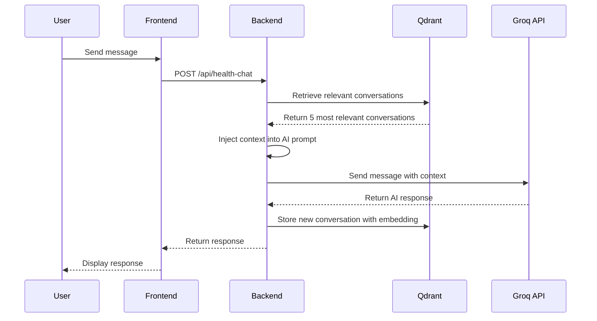

# Patient Memory System with Qdrant Vector Database

## Overview

This implementation adds a patient memory system using Qdrant vector database to store and retrieve patient chat history, symptoms, and medical interactions. The system uses semantic search with embeddings to retrieve the most relevant past conversations when a user sends a message.

## Features

✅ **Semantic Search**: Uses sentence transformers to create embeddings for semantic similarity search
✅ **Context-Aware Responses**: Retrieves last 5 relevant conversations based on query similarity
✅ **Automatic Storage**: Stores all conversations with embeddings after each interaction
✅ **Symptom Extraction**: Automatically extracts symptoms from user messages
✅ **Multi-language Support**: Works with all supported languages (Hindi, English, Bengali, etc.)
✅ **Patient Privacy**: Includes GDPR-compliant data deletion endpoint
✅ **Flexible Deployment**: Supports both in-memory and server-based Qdrant instances

## Architecture

### Backend Components

1. **`backend/patient_memory.py`** - Core patient memory system
   - `PatientMemorySystem` class handles all Qdrant operations
   - Uses `sentence-transformers` for embedding generation (all-MiniLM-L6-v2 model)
   - Provides methods for storing and retrieving conversations

2. **`backend/app.py`** - Updated Flask API
   - `/api/health-chat` - Enhanced with memory retrieval and storage
   - `/api/patient/history` - Get patient conversation history
   - `/api/patient/relevant-context` - Get relevant context for a query
   - `/api/patient/delete` - Delete all patient data (GDPR compliance)

### Frontend Components

1. **`src/api/ai-health-assistant.ts`** - Updated API client
   - Now calls backend API instead of direct Groq calls
   - Includes `patientId` in requests
   - Falls back to direct Groq API if backend unavailable

2. **`src/components/ai/AIHealthAssistant.tsx`** - Updated component
   - Uses `useAuth` hook to get current user ID
   - Passes `patientId` to API requests

## Installation

### 1. Install Python Dependencies

```bash
cd backend
pip install -r requirements.txt
```

New dependencies added:
- `qdrant-client==1.7.0` - Qdrant vector database client
- `sentence-transformers==2.2.2` - For generating embeddings

### 2. Configure Qdrant (Optional)

**Option A: In-Memory Mode (Default)**
No configuration needed. The system uses in-memory Qdrant by default.

**Option B: Qdrant Server Mode**
Add to `backend/.env`:
```env
QDRANT_URL=http://localhost:6333
QDRANT_API_KEY=your_api_key_here  # Optional
```

To run Qdrant server locally with Docker:
```bash
docker run -p 6333:6333 qdrant/qdrant
```

## How It Works

### 1. Conversation Flow



### 2. Semantic Search

When a user sends a message:
1. Generate embedding for the new message using sentence transformers
2. Search Qdrant for the 5 most semantically similar past conversations
3. Format retrieved conversations as context
4. Inject context into the system prompt
5. Send to AI model for response generation

### 3. Storage

After each conversation:
1. Extract symptoms from user message (keyword-based)
2. Combine user message and AI response into a single text
3. Generate embedding for the combined text
4. Store in Qdrant with metadata:
   - `patient_id`: Unique patient identifier
   - `user_message`: Original user message
   - `assistant_response`: AI response
   - `language`: Language code
   - `timestamp`: ISO timestamp
   - `symptoms`: List of detected symptoms
   - `metadata`: Additional metadata

## API Endpoints

### Chat with Memory
```http
POST /api/health-chat
Content-Type: application/json

{
  "message": "I have a headache",
  "language": "en",
  "chatHistory": [...],
  "patientId": "p1"
}

Response:
{
  "response": "I understand you're experiencing a headache...",
  "language": "en",
  "success": true,
  "contextUsed": true,
  "timestamp": "2026-01-22T10:30:00"
}
```

### Get Patient History
```http
GET /api/patient/history?patientId=p1&limit=10

Response:
{
  "history": [
    {
      "id": "uuid",
      "user_message": "I have a headache",
      "assistant_response": "...",
      "timestamp": "...",
      "symptoms": ["headache"]
    }
  ],
  "count": 10,
  "success": true
}
```

### Get Relevant Context
```http
POST /api/patient/relevant-context
Content-Type: application/json

{
  "patientId": "p1",
  "query": "My headache is getting worse",
  "limit": 5
}

Response:
{
  "conversations": [...],
  "formattedContext": "Previous relevant conversations:\n...",
  "count": 5,
  "success": true
}
```

### Delete Patient Data (GDPR)
```http
DELETE /api/patient/delete
Content-Type: application/json

{
  "patientId": "p1"
}

Response:
{
  "deletedCount": 25,
  "success": true,
  "message": "Deleted 25 records for patient p1"
}
```

## Configuration

### Environment Variables

Add to `backend/.env`:

```env
# Existing variables
ASSEMBLYAI_API_KEY=your_key_here
GROQ_API_KEY=your_key_here

# Optional: Qdrant configuration
QDRANT_URL=http://localhost:6333
QDRANT_API_KEY=your_api_key_here
```

### Embedding Model

The default model is `all-MiniLM-L6-v2` (384 dimensions). To change:

```python
# In backend/patient_memory.py
self.embedding_model = SentenceTransformer('your-model-name')
self.embedding_dimension = YOUR_MODEL_DIMENSION
```

Popular alternatives:
- `all-mpnet-base-v2` (768 dim) - More accurate, slower
- `paraphrase-multilingual-MiniLM-L12-v2` (384 dim) - Better for multilingual
- `msmarco-distilbert-base-v4` (768 dim) - Good for questions

## Testing

### 1. Start the Backend

```bash
cd backend
python app.py
```

Check for successful initialization:
```
✅ Skin analysis module loaded successfully
✅ Patient memory system loaded successfully
🔑 AssemblyAI API Key: ✅ Set
🔑 Groq API Key: ✅ Set
🚀 Starting CareMate Backend Server...
```

### 2. Test Memory System

```python
# Test script
from patient_memory import get_memory_system

# Initialize
memory = get_memory_system()

# Store conversation
conv_id = memory.store_conversation(
    patient_id="test_patient",
    user_message="I have fever and cough",
    assistant_response="I understand you're experiencing fever and cough...",
    language="en",
    symptoms=["fever", "cough"]
)
print(f"Stored: {conv_id}")

# Retrieve relevant conversations
relevant = memory.retrieve_relevant_conversations(
    patient_id="test_patient",
    query="My cough is getting worse",
    limit=5
)
print(f"Found {len(relevant)} relevant conversations")
```

### 3. Test via API

```bash
# Test health endpoint
curl http://localhost:5000/api/health

# Test chat with memory
curl -X POST http://localhost:5000/api/health-chat \
  -H "Content-Type: application/json" \
  -d '{
    "message": "I have a headache",
    "language": "en",
    "chatHistory": [],
    "patientId": "test_patient"
  }'

# Get patient history
curl http://localhost:5000/api/patient/history?patientId=test_patient
```

## Benefits

### For Patients
- **Continuity of Care**: AI remembers previous symptoms and conditions
- **Personalized Responses**: Context-aware advice based on medical history
- **Better Symptom Tracking**: System tracks symptoms over time

### For Healthcare Providers
- **Rich Patient Data**: Access to full conversation history
- **Symptom Tracking**: Automatic extraction and storage of symptoms
- **Better Insights**: Semantic search reveals patterns in patient concerns

### Technical Benefits
- **Scalable**: Qdrant handles millions of vectors efficiently
- **Fast**: Semantic search returns results in milliseconds
- **Flexible**: Works with any embedding model
- **Privacy-Compliant**: Built-in data deletion for GDPR compliance

## Performance Considerations

### Memory Usage
- In-memory mode: ~50MB for embedding model + data storage
- Server mode: Minimal memory footprint

### Speed
- Embedding generation: ~10-50ms per message
- Semantic search: ~5-20ms for 1000s of conversations
- Total overhead: ~50-100ms per request

### Scaling
- **In-memory**: Good for up to 10,000 conversations
- **Server mode**: Handles millions of conversations
- Consider using GPU for faster embedding generation at scale

## Troubleshooting

### Import Error
```
⚠️ Patient memory system not available: No module named 'qdrant_client'
```
**Solution**: Install dependencies: `pip install -r requirements.txt`

### Memory System Not Working
Check backend logs for:
```
✅ Patient memory system loaded successfully
```

If missing, check for import errors in `patient_memory.py`

### Slow Performance
- Use server-based Qdrant for better performance
- Consider using a smaller embedding model
- Reduce the number of retrieved conversations (default: 5)

### Context Not Being Used
Check response for `"contextUsed": true` field. If false:
- Patient may have no previous conversations
- Check patient ID is consistent across requests

## Future Enhancements

### Planned Features
- [ ] Advanced symptom extraction using NER models
- [ ] Time-aware context retrieval (recent vs. historical)
- [ ] Symptom progression tracking and visualization
- [ ] Integration with structured medical records
- [ ] Multi-modal support (images, audio, etc.)
- [ ] Doctor review and annotation of conversations
- [ ] Automatic summarization of patient history

### Advanced Features
- Custom embedding models for medical domain
- Hybrid search (semantic + keyword)
- Re-ranking of retrieved conversations
- Federated learning for privacy
- Export to standard medical formats (HL7, FHIR)

## Security & Privacy

### Data Protection
- All conversations are stored with patient ID isolation
- Supports data deletion for GDPR compliance
- Can be configured with encrypted Qdrant instances
- No PII is logged in application logs

### Best Practices
1. Use environment variables for sensitive configuration
2. Enable authentication before production deployment
3. Regularly backup Qdrant data
4. Implement rate limiting on API endpoints
5. Use HTTPS for all API communications
6. Consider using Qdrant Cloud for managed security

## License

This implementation is part of the CareMate healthcare application.

## Support

For issues or questions:
1. Check the troubleshooting section above
2. Review Qdrant documentation: https://qdrant.tech/documentation/
3. Review sentence-transformers docs: https://www.sbert.net/

---

**Note**: This system is designed to enhance patient care but should not replace professional medical diagnosis. Always encourage users to consult healthcare professionals for serious concerns.
